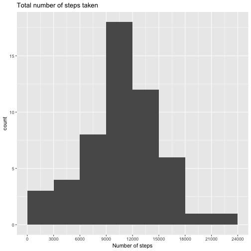
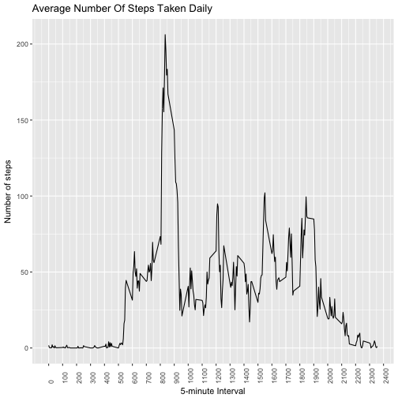
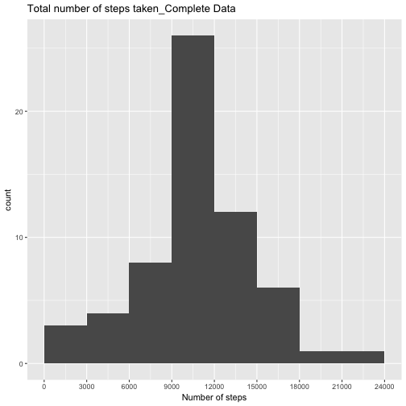

### 1. Reading data
Cleaning the workspace and loading the libraries

```r
remove(list=ls())
library(ggplot2)
library(dplyr)
```
Loading data assuming the zipped data was saved to the working directory

```r
unzip("activity.zip", exdir = getwd())
activity <- read.csv("activity.csv", na.strings = "NA")
```
Converting dates into date format

```r
activity$date <- as.Date(activity$date)
```

### 2. Histogram of the total number of steps taken each day
Aggregating the total number of steps by date and plotting with ggplot2

```r
total.steps.day <- summarise(group_by(activity, date), steps=sum(steps))
qplot(total.steps.day$steps, geom = "histogram", main="Total number of steps taken", xlab = "Number of steps", breaks = seq(0, 24000, by = 3000)) + scale_x_continuous(breaks = seq(0, 24000, by = 3000))
```

```
## Warning: Removed 8 rows containing non-finite values (stat_bin).
```



### 3. Mean and median number of steps taken each day

```r
mean(total.steps.day$steps, na.rm = TRUE)
```

```
## [1] 10766.19
```

```r
median(total.steps.day$steps, na.rm = TRUE)
```

```
## [1] 10765
```

### 4. Time series plot of the average number of steps taken
Aggregating the average number of steps by interval and plotting with ggplot2

```r
average.steps.interval <- summarise(group_by(activity, interval), steps=mean(
        steps, na.rm = TRUE))
ggplot(data=average.steps.interval, aes(x=interval, y=steps))+geom_line()+
        ggtitle("Average Number Of Steps Taken Daily")+xlab("5-minute Interval")+
        ylab("Number of steps")+theme(axis.text.x=element_text(angle = 90, hjust = 0))+
        scale_x_continuous(breaks = pretty(average.steps.interval$interval, n=20))
```



### 5. The 5-minute interval that, on average, contains the maximum number of steps

```r
average.steps.interval[average.steps.interval[,"steps"]==max(average.steps.interval$steps, na.rm=TRUE),]
```

```
## # A tibble: 1 x 2
##   interval    steps
##      <int>    <dbl>
## 1      835 206.1698
```

### 6. Code to describe and show a strategy for imputing missing data
Taking a look at missing vales

```r
sum(is.na(activity))
```

```
## [1] 2304
```

```r
NAs <- subset(activity, is.na(activity))
NAs <- transform(NAs, count=1)
table(NAs$date, NAs$count)
```

```
##             
##                1
##   2012-10-01 288
##   2012-10-08 288
##   2012-11-01 288
##   2012-11-04 288
##   2012-11-09 288
##   2012-11-10 288
##   2012-11-14 288
##   2012-11-30 288
```
8 days are completely lost. These NAs will be substituted by the mean number of steps for a particular 5-minute interval across all days

```r
activity.complete <- activity
for(i in 1:nrow(activity.complete)){
        if(is.na(activity.complete$steps[i])==TRUE){
                        activity.complete$steps[i] <- average.steps.interval$steps[match(activity.complete$interval[i], average.steps.interval$interval)]
        }
}
```
Checking if the NAs are gone

```r
sum(is.na(activity.complete))
```

```
## [1] 0
```
Calculating new mean and median number for complete data

```r
total.steps.day.complete <- summarise(group_by(activity.complete, date), steps=sum(steps))
mean(total.steps.day.complete$steps)
```

```
## [1] 10766.19
```

```r
median(total.steps.day.complete$steps)
```

```
## [1] 10766.19
```

### 7. Histogram of the total number of steps taken each day after missing values are imputed
Using imputed data, aggregating the total number of steps by date and plotting with ggplot2

```r
total.steps.day.complete <- summarise(group_by(activity.complete, date), steps=sum(steps))
qplot(total.steps.day.complete$steps, geom = "histogram", main="Total number of steps taken_Complete Data",
      xlab = "Number of steps", breaks = seq(0, 24000, by = 3000)) + scale_x_continuous(breaks = seq(0, 24000, by = 3000))
```



### 8. Panel plot comparing the average number of steps taken per 5-minute interval across weekdays and weekends
Recoding dates to "weekday" and "weekend" 

```r
activity.complete$daytype <- weekdays(activity.complete$date)
activity.complete$day <- ifelse(activity.complete$daytype %in% c("Saturday", "Sunday"), "weekend", "weekday")
```
Aggregating the average number of steps by weekday(end) and plotting with ggplot2

```r
average.steps.interval.day <- summarise(group_by(activity.complete, interval, day), steps=mean(
        steps, na.rm = TRUE))
ggplot(data=average.steps.interval.day, aes(x=interval, y=steps))+geom_line()+
        ggtitle("Average Number Of Steps Taken Daily")+xlab("5-minute Interval")+
        ylab("Number of steps")+theme(axis.text.x=element_text(angle = 90, hjust = 0))+
        scale_x_continuous(breaks = pretty(average.steps.interval$interval, n=20))+
        facet_grid(day~.)
```

-1.png)
